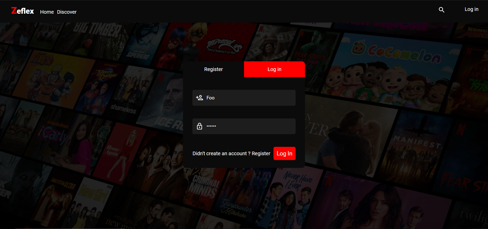
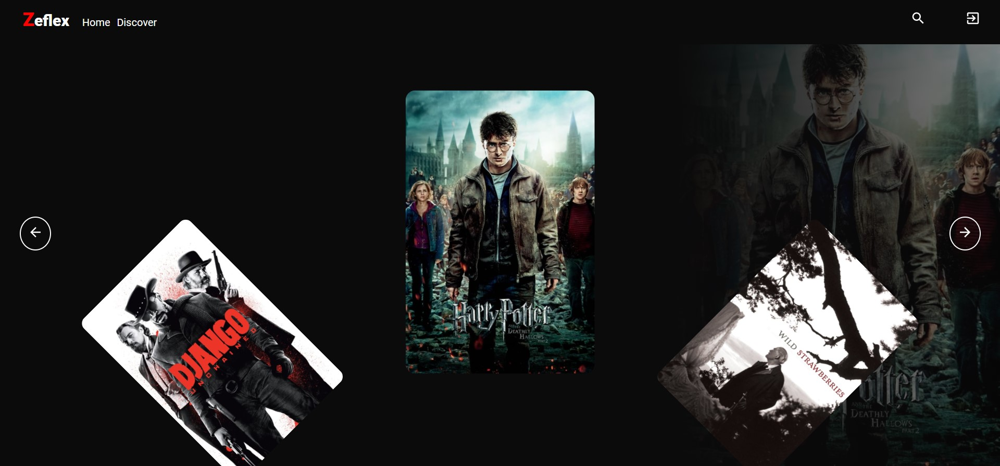
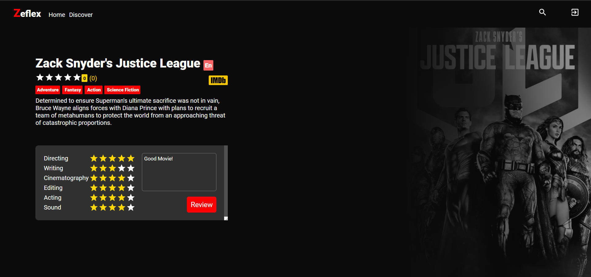
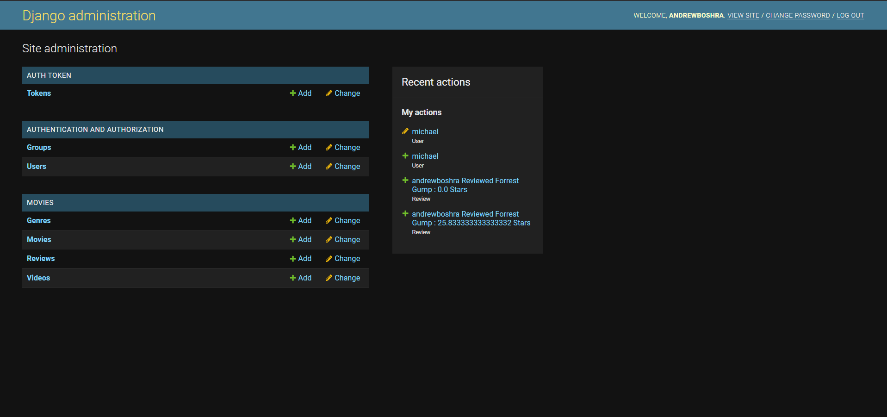

# Zeflex

A movie discovery and review site — search films, read descriptions, and leave reviews. Inspired by Netflix.

## Stack

Django 3.2 · Django REST Framework · React · Material-UI · SCSS · deployed on Render

## Features

- Browse and search a movie catalogue
- Movie detail pages with descriptions and artwork
- Authentication — an account is required to post a review
- Ratings and written reviews

## Running it

Backend:

```bash
pip install -r requirements.txt
python manage.py migrate
python manage.py loaddata fixtures.json
python manage.py runserver
```

Frontend:

```bash
yarn install
yarn start
```

## Notes

Built in 2021–2022. Screenshots are in the `ScreenShots/` directory.

## Screenshots






* 
